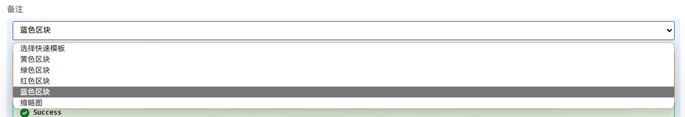
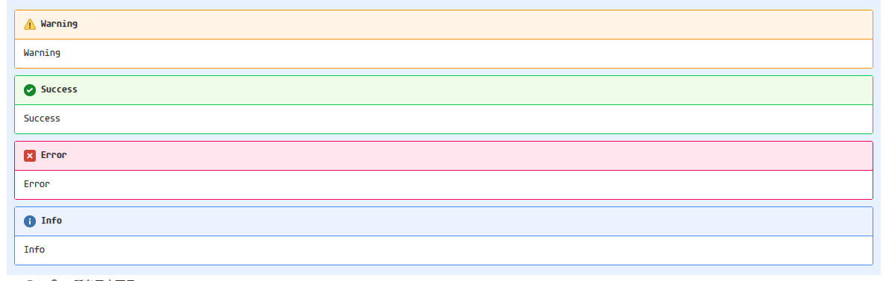

# 油猴脚本

本库是油猴脚本的开源项目。

  

## Jenkins参数筛选工具

- 传送门：[jenkins_param_filter.js](./jenkins_param_filter.js)
- 安装路径：[Greasy Fork](https://greasyfork.org/zh-CN/scripts/494230-jenkins%E7%BC%96%E8%AF%91%E5%8F%82%E6%95%B0%E7%AD%9B%E9%80%89)

在Jenkins的编译参数选择界面，调整原生的下拉框，使其支持筛选功能。  

## JIRA快速备注模板

- 传送门：[jira_quick_comment.js](./jira_quick_comment.js)
- 安装路径：[Greasy Fork](https://greasyfork.org/zh-CN/scripts/494461-jira%E5%BF%AB%E9%80%9F%E5%A4%87%E6%B3%A8%E6%A8%A1%E6%9D%BF%E5%B7%A5%E5%85%B7)

在JIRA页面，搜索comment-wiki-edit元素。在该元素下添加一个select控件。  
控件预置了JIRA的panel格式模板。

> 配色来源于material-docs的配色。非常漂亮。  
> https://squidfunk.github.io/mkdocs-material/reference/admonitions/

### 效果展示

- 菜单展示
  

- 面板效果展示

